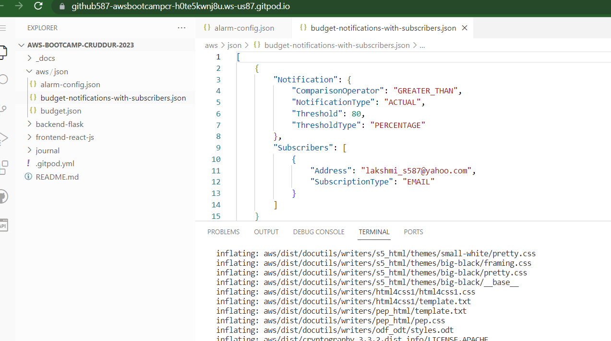
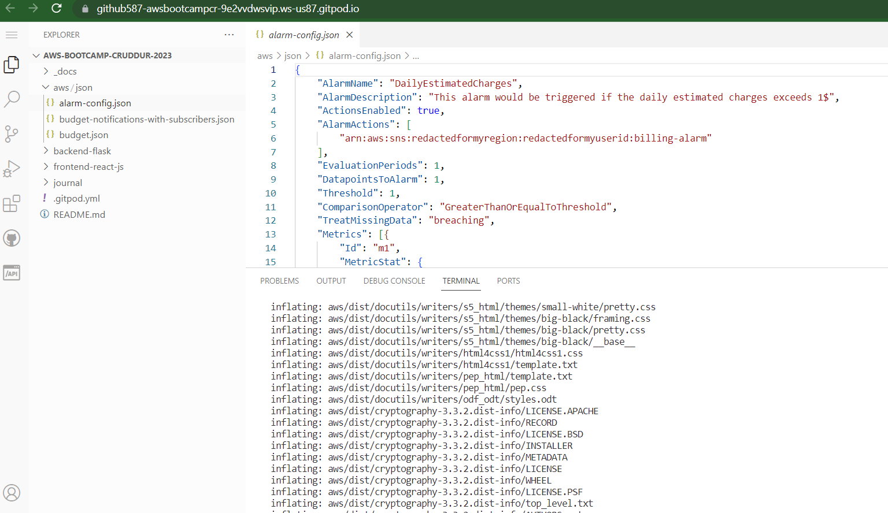

# Week 0 — Billing and Architecture

## REQUIRED HOMEWORK

### Install  and verify AWS CLI
Added task to download and install aws cli to gitpod.yml file.
Verified that aws is installed as the workspace opens each time on gitpod by running either aws --version or aws sts get-caller-identity.
Setup user credentials and exported them as gitpod env variables.

### Created AWS Budget by using budget.json
verified that budget - Example Tag Budget is created on the console for the user.

### Created billing alarm using AWS CLI on gitpod

First, created SNS topic for the billing alarm using budget-notification.json and verified using the console

Then, created the billing alarm using alarm-config.jsonn and verified using the console.

### Conceptual diagram /napkin diagram

## HOMEWORK CHALLENGES

