# Week 0 — Billing and Architecture

## REQUIRED HOMEWORK

### 	Recreate Conceptual Diagram in Lucid Charts or on a Napkin
Created the conceptual diagram s discussed in class using LucidChart. Link and image shared below.
- Link to lucidchart for my diagram:
[Conceptual Diagram](https://lucid.app/lucidchart/d0a234d5-108a-4971-ad6b-984141f62fc1/edit?viewport_loc=-10%2C15%2C1707%2C733%2C0_0&invitationId=inv_131b43ef-7fb5-4136-acd8-dfd3cf764f71)
 
- Conceptual diagram image below:
 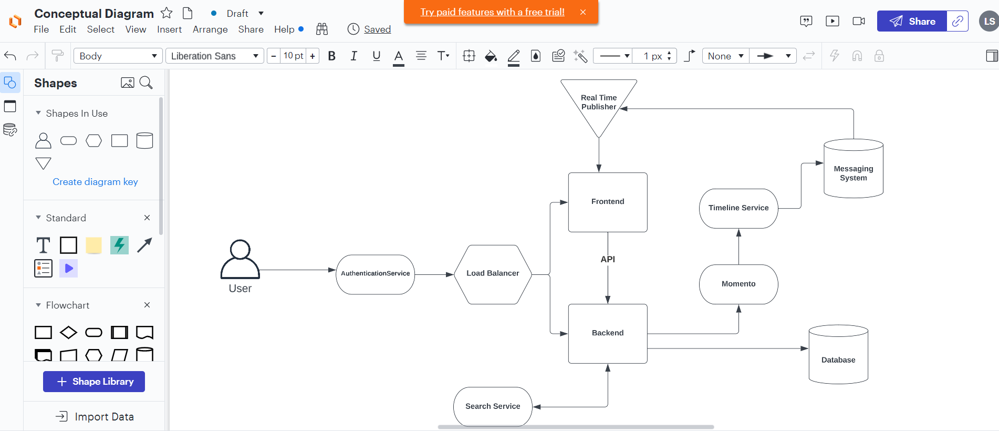


### Install  and verify AWS CLI
Added task to download and install aws cli to gitpod.yml file.
Verified that aws is installed as the workspace opens each time on gitpod by running either aws --version or aws sts get-caller-identity.
Setup user credentials and exported them as gitpod env variables.

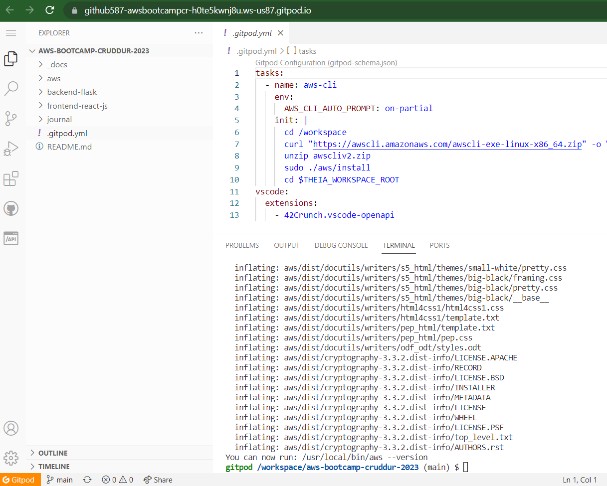

### Created AWS Budget by using budget.json
verified that budget - Example Tag Budget is created on the console for the user.
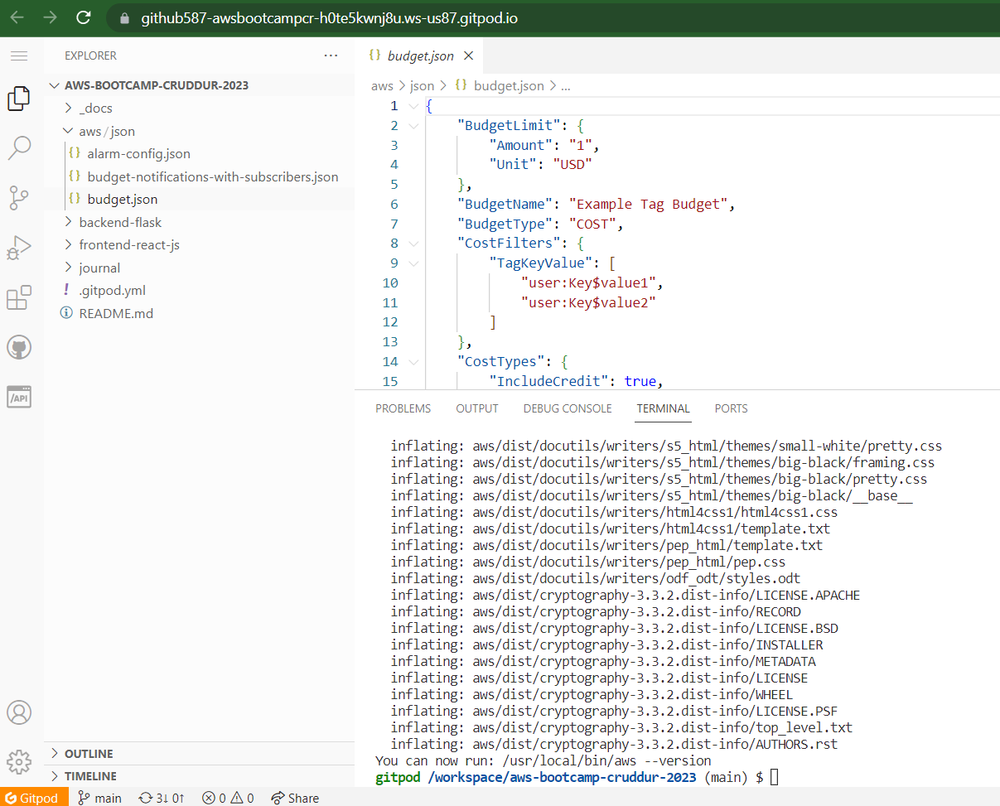

Screen from console after the AWS create budget command is run.
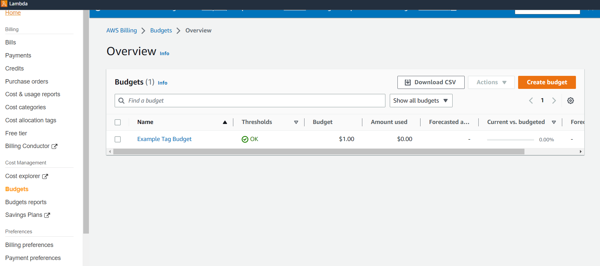

### Created billing alarm using AWS CLI on gitpod

First, created SNS topic for the billing alarm using budget-notification.json and verified using the console

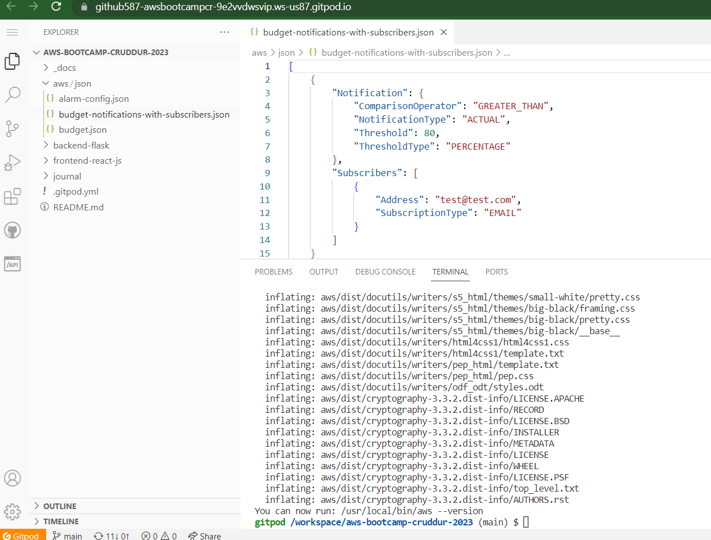

verified that the SNS topic got created on the AWS admin console

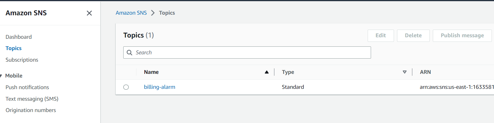

Then, created the billing alarm using alarm-config.jsonn and verified using the console.

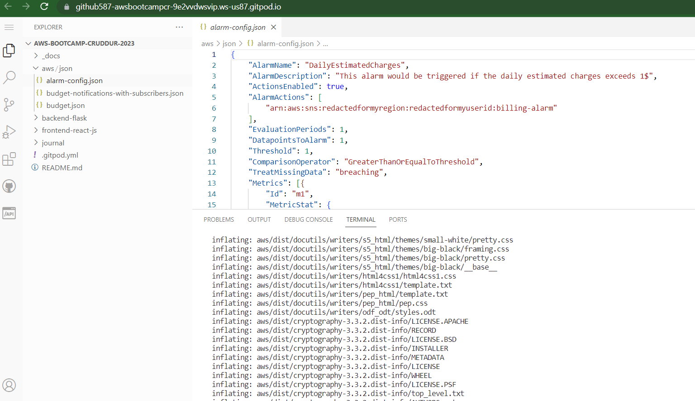

Verified on the AWS adminconsole that the cloud watch alarm is created.

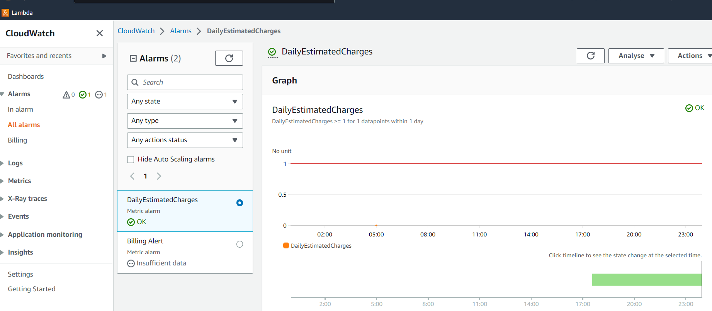


## HOMEWORK CHALLENGES

### Recreate Logical Architectual Diagram in Lucid Charts
[Logical_architecture_diagram](https://lucid.app/lucidchart/7844b4af-be10-48fb-9f74-15f41e85f10d/edit?viewport_loc=-2%2C-225%2C1707%2C811%2C0_0&invitationId=inv_0fbbfb56-5f44-4966-84c0-a3191f6633c4)

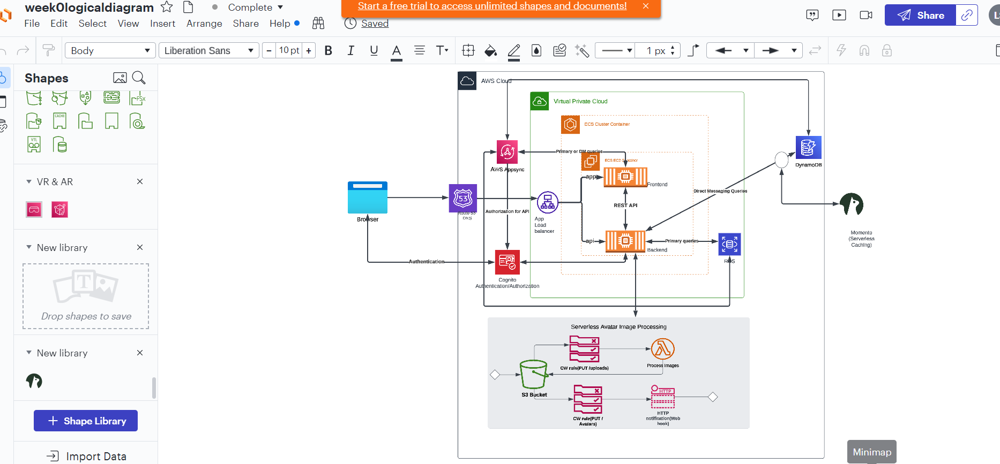

### Add an eventbridge rule to hookup AWS healthdashboard to SNS.
Performed this to watch for EC2 issue. Code snippet and rule setup on teh AWS console image as below:
```
{
  "source": ["aws.health"],
  "detail-type": ["AWS Health Event"],
  "detail": {
    "service": ["EC2"],
    "eventTypeCategory": ["issue"]
  }
}
```
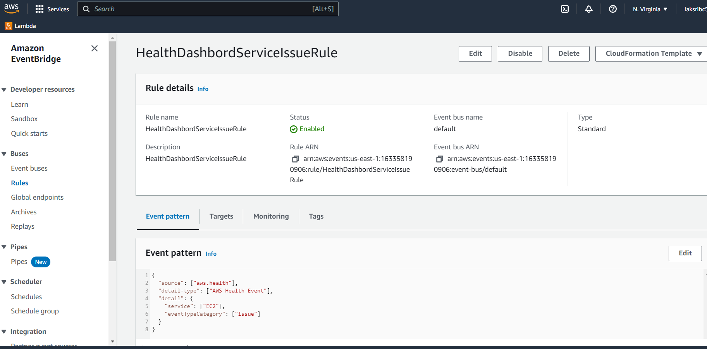

### CI /CD pipeline architcture diagram for cruddur codebase

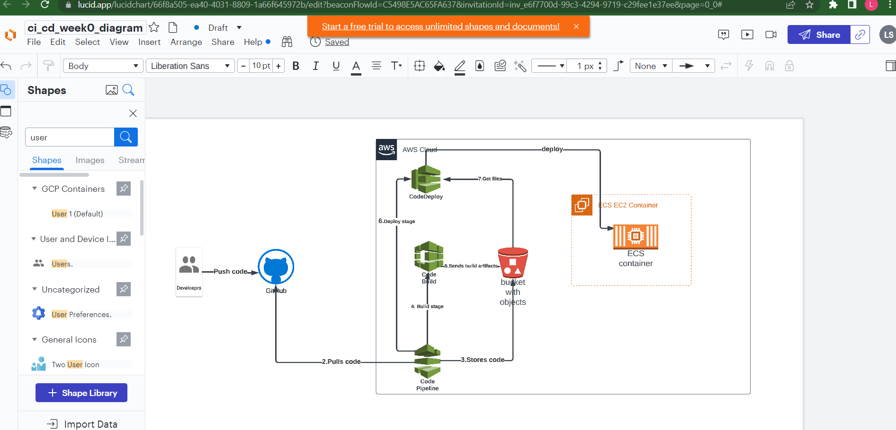
