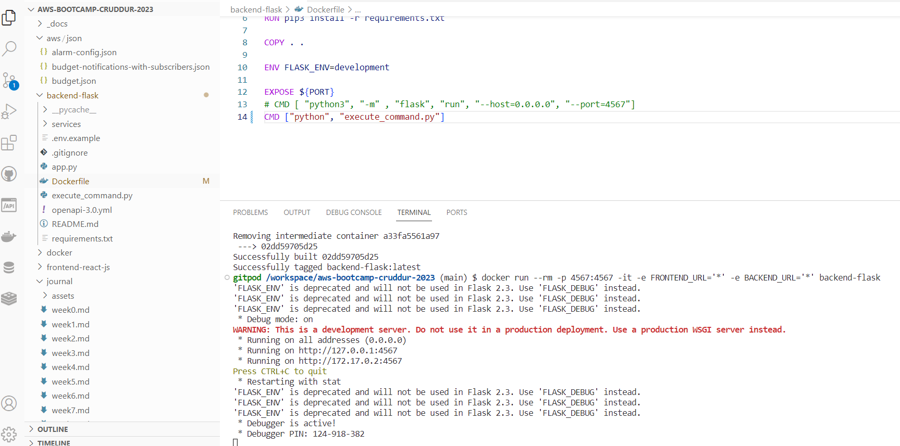
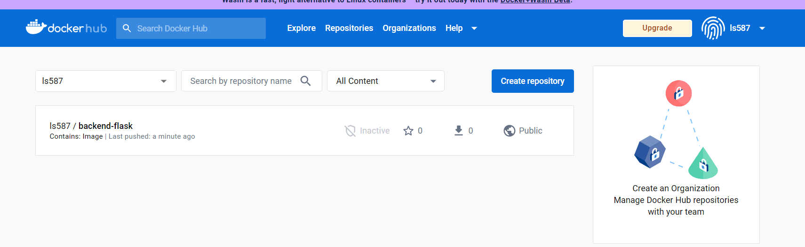
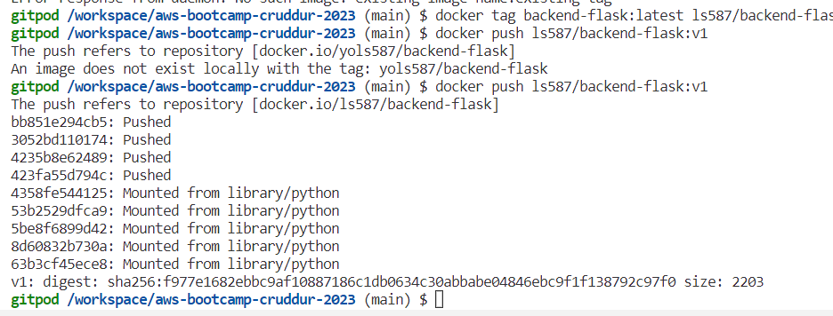

# Week 1 — App containertainerization

## backend flask containerization
Installed docker plugin if not available in VSCODE
Created backend-flask/Dockerfile to build and then run the dockerfile with docker commands below
- built it with ```docker build -t  backend-flask ./backend-flask```
- ran teh container with ``` docker run --rm -p 4567:4567 -it -e FRONTEND_URL='*' -e BACKEND_URL='*' backend-flask```
- to run in background ```docker container run --rm -p 4567:4567 -d backend-flask```
- Set the container Id to env variable using ```CONTAINER_ID=$(docker run --rm -p 4567:4567 -d backend-flask)```
- Checked for the exisitng container  and images running ``` docker images docker ps -a``` (-a to get tall the containers not removed but in exit state, use -rm arg to remove contaienrs after they are done executing)
- Ensured the ports are open using the ports tab and that teh lock in unlocked, to avoid CORS issue, also make sure the port in the app url mentioned matches what is set to be open)
- Tested teh app for backend using the command ```curl -X GET http://localhost:4567/api/activities/home -H "Accept: application/json" -H "Content-Type: application/json"```
### some useful commands/ extension to troubleshoot that I learnt
- to debug contaienrs with other containers use ```docker run --rm -it curlimages/curl "-X GET http://localhost:4567/api/activities/home -H \"Accept: application/json\" -H \"Content-Type: application/json\""```(yet to try this commnd , with docker extension-  I just right clicked on the container and reviewed the  logs in VSCode)
-Alternatively, You can also debug containers with ```docker run --rm -it busybox```
- ```docker exec CONTAINER_ID -it /bin/bash``` to gain access to teh container
- to delete an image with force ```docker image rm backend-flask --force```
-  to override ports use, FLASK_ENV=production PORT=8080 docker run -p 4567:4567 -it backend-flask

## front-end react app containerization
I learnt that I had to run npm i everytime before brining up the front end contaienr as follows. Alternatively, I plan to set npm i as task in gitpod.yml
Ran ``` cd frontend-react-js ``` and then ```npm i```
### containerization steps
1. created a dockerfile uinsg 
  ```FROM node:16.18
ENV PORT=3000
COPY . /frontend-react-js
WORKDIR /frontend-react-js
RUN npm install
EXPOSE ${PORT}
CMD ["npm", "start"]
``` 
* FROM keyword indicates the baseline docker image to start.
2. Built and ran the container using the commands
```docker build -t frontend-react-js ./frontend-react-js```
and run with ```docker run -p 3000:3000 -d frontend-react-js```
Tried set FRONT_END_URL and BACKEND_URL and unset them

## TO SPIN MULTIPLE CONTAINERS (FRONT and BACK END in this case)
### use docker-compose.yml 
1. created a docker-compose.yml file at the root of cruddr project in github
2. Right cliked on teh yml filre and ran docker compose up to spin up and compose down to get teh containers out.
3. Tested that the URL works and the app is up and running.

## SETUP DYNAMODB local and PostGres client
1. Edited docker-compose.yml to add services for dunamodb loal and prstgres.
2. Tested dynamodb local by using the table/item creation in the link under https://github.com/100DaysOfCloud/challenge-dynamodb-local
3. Tested postgres by connecting to get a success message on teh client. Add teh client command to gitpod.yml 


### added volumes that map the local code to the container for hot deploy 
Verify the mounted volumes unde the volumes tab of dockerfile extension
```
volumes:
  db:
    driver: local
```
### OPEN API documentaiton
1. learnt that openapi can help produce api documnetaiton
2. added notification section to openapi.yml to see the notification api appear in the doc.

### frontend and backend-flask module and notification changes
1. 


## STRETCH ASSINGMENTS
### Run the dockerfile CMD as an external script
1. Created an execute_command python script in backend_flask direcory as follows with subprocess defined.
```
import subprocess

flask_command = 'flask run --host=0.0.0.0 --port=4567'

subprocess.run(flask_command, shell=True)
```
2. Hooked up execute_sommand.py to run in docker file as follows
 ```
CMD ["python", "execute_command.py"]
```
3. Built the backend_flask image with docker build and ran the container with docker run commands.
Output as folows to bring falsk up and running.


### Push and tag a image to DockerHub (they have a free tier)
1. login to dockerhub with ``` docker login ``` command
2. Used Docker tag command to add a new tag to an exisitng docker image using
``` docker tag backend-flask:latest ls587/backend-flask:v1 ```
3. Pusjed the image to dockerhub using the command
``` docker push ls587/backend-flask:v1 ```
4. verified teh image on dockerhub UI as below:




